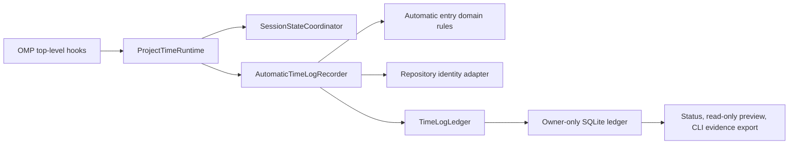

# Evidence Pipeline Architecture

## Purpose

The architecture records automatic Project Time evidence without coupling OMP event handling to SQLite details or downstream billing policy.

## Ownership and Direction

| Owner                                                    | Responsibility                                                                                                 | Depends on                                           |
| -------------------------------------------------------- | -------------------------------------------------------------------------------------------------------------- | ---------------------------------------------------- |
| `src/index.ts` and `src/omp-extension.ts`                | Public extension entrypoint and default activity generator wiring                                              | OMP extension API                                    |
| `src/extension/runtime.ts`                               | Registers OMP hooks and commands; coordinates status, activity generation, state, and recorder calls           | Extension interfaces and application/domain services |
| `src/extension/application/session-state-coordinator.ts` | Owns active-window session-state transitions                                                                   | Domain state                                         |
| `src/time-log/recorder.ts`                               | Converts session settlements and agent turns into automatic-entry inputs; serializes per-session activity work | Git adapter, domain entry creation, ledger           |
| `src/time-log/domain/`                                   | Entry shape, validation, source keys, attribution, and interval rules                                          | Scalar utilities only                                |
| `src/time-log/infrastructure/ledger.ts`                  | Locking, SQLite initialization, owner-only permissions, JSON migration, and serialization                      | Domain parsing and Node/Bun SQLite adapter           |
| `src/infrastructure/git-repository.ts`                   | Produces sanitized repository labels and normalized identity                                                   | Git subprocess boundary                              |
| `src/project-time-cli.ts`                                | Reads the local ledger and writes the public evidence snapshot                                                 | Recorder and snapshot mapper                         |

Dependencies flow from OMP adapters toward domain rules and persistence. The domain does not call OMP, Git, SQLite, or a billing provider.

## Persistence and Migration

The default ledger is `~/.omp/project-time/time-log.sqlite`. The ledger serializes cross-window operations with a file lock, creates the parent directory owner-only, and applies owner-only database permissions. On first access it transactionally imports a valid legacy `time-log.json` file, retaining the original file as a rollback backup. Invalid legacy JSON remains untouched and is not partially imported.

The public `entries` snapshot is intentionally stable across the internal JSON-to-SQLite migration. Consumers receive raw evidence fields rather than SQLite rows.

## Configuration Boundary

Configuration loading validates untrusted plugin configuration before runtime use. The public configuration permits only three scalar settings. Retired repository-billing settings fail explicitly rather than silently changing behavior.

## Sources

- Runtime and command adapters: [`src/extension/runtime.ts`](../../src/extension/runtime.ts), [`src/project-time-cli.ts`](../../src/project-time-cli.ts)
- Recorder and domain: [`src/time-log/recorder.ts`](../../src/time-log/recorder.ts), [`src/time-log/domain/`](../../src/time-log/domain/)
- Ledger: [`src/time-log/infrastructure/ledger.ts`](../../src/time-log/infrastructure/ledger.ts)
- Config parsing: [`src/config/`](../../src/config/)
- Persistence and config tests: [`test/time-log.test.ts`](../../test/time-log.test.ts), [`test/config.test.ts`](../../test/config.test.ts)
